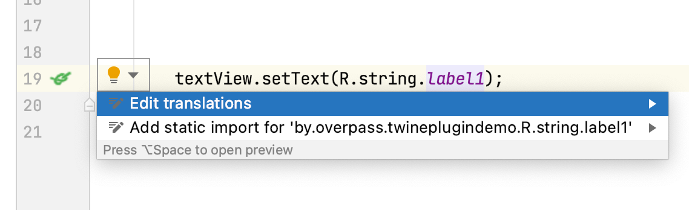

# Twine Plugin

Android Studio support for twine localization tool (https://github.com/scelis/twine)

#Demo

#Usage

- Install the plugin from Jetbrains Marketplace.

<iframe frameborder="none" width="245px" height="48px" src="https://plugins.jetbrains.com/embeddable/install/17310"></iframe>

- In order for the plugin to work correctly <a href="https://github.com/scelis/twine">Twine</a> should be configured in the project. 
- Your Twine file is expected to have .twine extension.